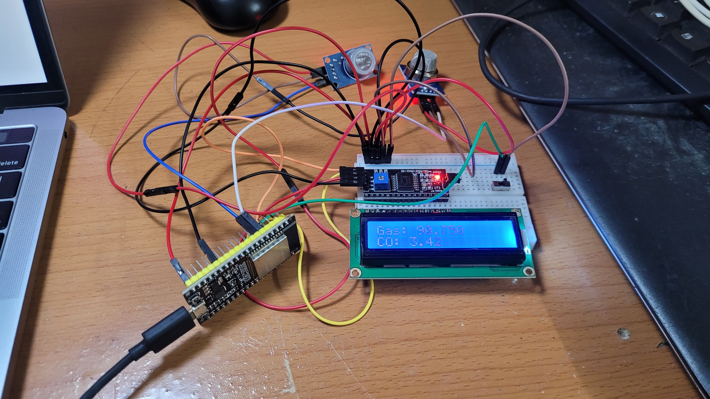

# Air Quality Monitor

This air quality monitor can measure the amount of gas/CO2 and CO in the air using the ESP32. There's also a web server running on the ESP32 displaying the measurements in real-time and you can get the IP for the server by checking the serial communication.

## Schematic

## Website

## Electronics

> *Warning*: Very messy

