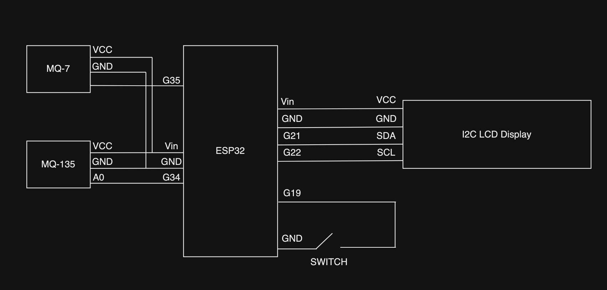
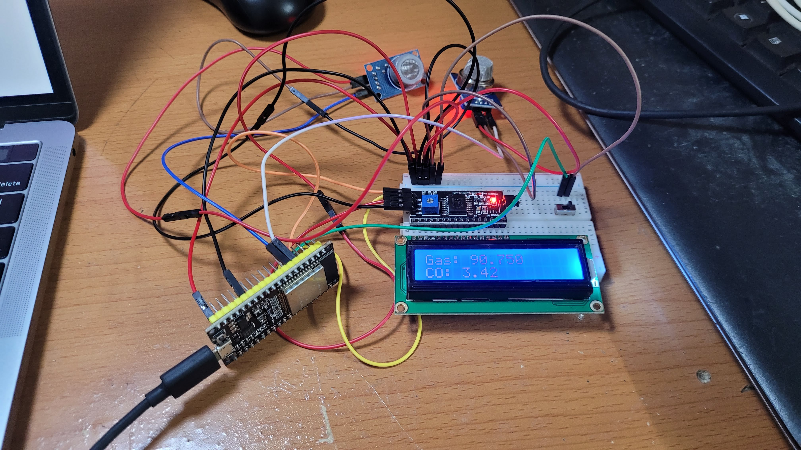

# Electronics

Schematic for electronics:



Picture of the electronics:



# Sensors

The sensors used in this project are the MQ-7 and the MQ-135. MQ-7 for CO measuring and MQ-135 for hazardous gas.

# LCD screen

The LCD screen displays data about the measurements. It has 2 screens, 1 for displaying whether the air quality is good or bad, 1 for displaying the actual PPM measurement. 

The screen can be switched using the a button connected to pin G19.

# PPM calculation

1. The function converts raw analog data into the voltage that corresponds to that reading
2. Calculate the resistance of the gas sensor based on the voltage drop and the 10k ohm load resistance
3. Calculate the ratio of sensor resistance to baseline resistance. This gives an indication of the change in resistance due to the presence of the target gas
4. Using the sensor's calibration curve (slope and intercept), we can calculate the logarithm of the gas concentration
5. Finally, we can convert this logarithmic value to a linear PPM value

This method relies on the specific characteristics of the gas sensor (provided in the sensor's datasheet)

The calibration curve parameters (`m` and `c`) are derived from the sensor's response to different gas concentrations and are used to translate the sensor's resistance changes into gas concentration readings

# Web server

The HTTP web server is initialized to an asynchronous web server to handle many HTTP requests concurrently.

Web server has a web socket endpoint on `/ws`. This is where the sensor data will be send to and where the server will take measurement data from that endpoint. 

When the ESP32 is connected to the WiFi network, the HTTP server will be intialized to the IP address of the ESP32. When someone sends a GET request to the ESP32's IP address, it will return an HTML site hosted on the server (website stored in flash memory) with a 200 status code.

The website will initialize a web socket object when it is loaded. The web socket object listens to data sent to the endpoint `/ws`.

The web socket object will have an `onmessage` function to handle receiving incoming message to the socket endpoint.

The data will have this structure:

```
gas_value,co_value
```

We'll just split the comma and extract the gas and CO values.

We can send data to the web server's socket endpoint using the web socket object's `textAll` function. We need to make sure the data is formatted with the proper structure.

# ThingSpeak data logging

We can log the data measured by the sensor into ThingSpeak. We can do this by using ThingSpeak's API and sending the data to http://api.thingspeak.com/update. We need to specify the API key and the data in the URL. 

Once we setup the proper URL, we can send a GET request to the ThingSpeak's server to log the data. We can access this data later on and graph it out.
